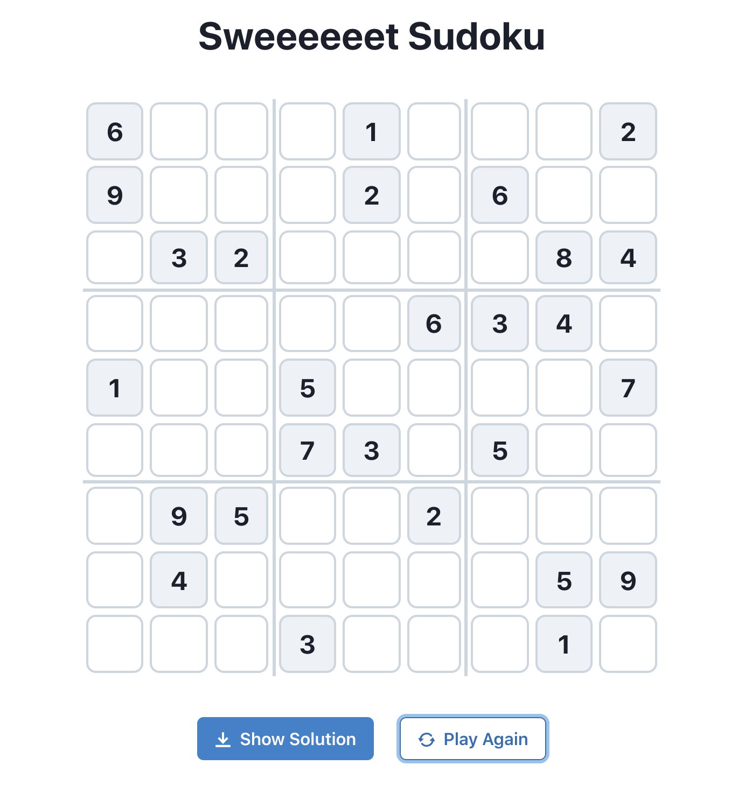
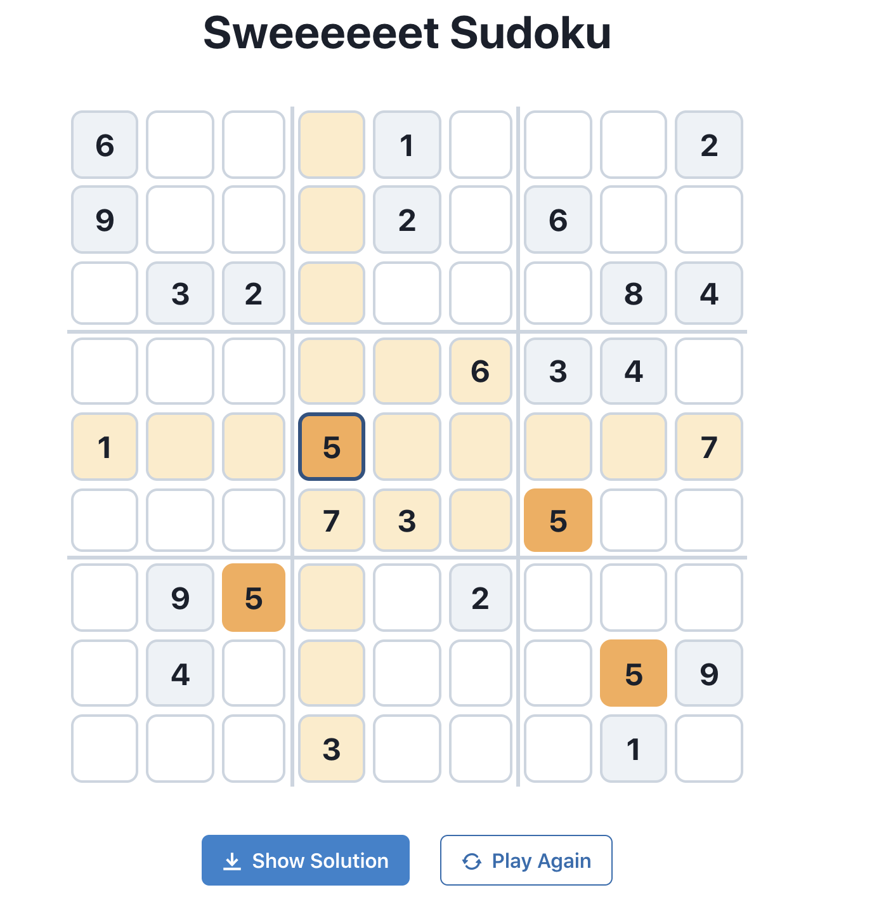
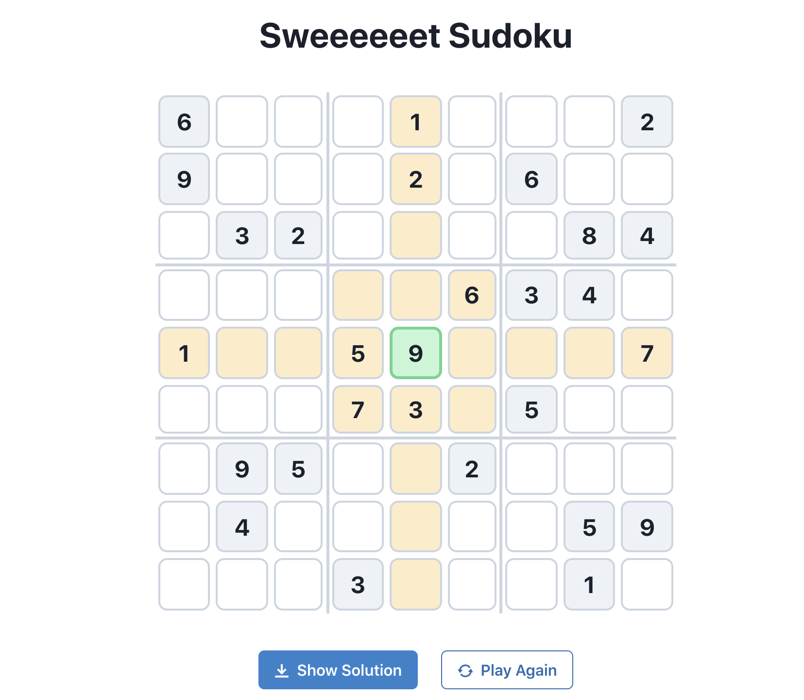
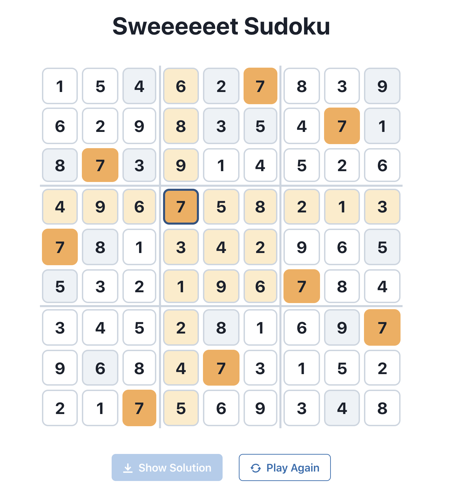

# Sweet Sudoku 

Live deployment: https://sudoku-gskll.vercel.app

Playable Sudoku game built using React with Chakra-UI styling library.


`App` component renders the header, `SudokuBoard` and `BoardButtons` components

- `BoardButtons` displays one button to show the solution and another to reset the game with a new board
- `SudokuBoard` displays a spinner if loading, or a list of the `SudokuField` components put into a CSS grid
- `SudokuField` handles the display/styles of each field as well as checking input validity and updating the board data


The app started with generating an array of numbers to represent the board, but the data structure changed in order to make the various UI elements possible.

`generateSudoku.js` returns the following dictionary, where `board` is an array of dictionaries containing information on each board field, and `boardMapping` is a dictionary containing the confirmed indices of each value. 

`boardMapping` is necessary in order to highlight the fields with the same value as the selected field

```javascript
 *  {
 *    board: [
 *        {
 *          index: int:[0-80],
 *          row: int:[0-8],
 *          col: int:[0-8],
 *          value: int:[1-9],
 *          readonly: bool,
 *          given: bool,
 *          solution: int:[1-9]
 *        },
 *        ...
 *   ],
 *   boardMapping: {
 *     1 : [indices],
 *     2 : [indices],
 *     ...
 *   }
 *  }
```


## Get started locally

1. Clone the repo
2. Install necessary packages with `npm install` or `yarn install`
3. Run the server with `npm start` or `yarn start`

## UI features

- 'Given' fields have a grey background
- Clicking on a field 'selects' it, clicking outside the board deselects all fields
- A selected field has an blue border, and all the fields on the same row, column and sub-grid are highlighted in orange
- A selected field has all the other confirmed fields of the same value highlighted in orange
- Fields will only accept digits 1-9 as input
- If the input is wrong the field will highlight red for 800 ms then reset to empty
- If the input is correct the field will highlight green for 800 ms then update the board data structure accordingly. This field is set to readonly and can no longer be edited
- If you try to edit a given field or a readonly field, a warning toast will appear the first time only informing you that you can't


## File structure

```bash
src/
├── components
│   ├── App.js
│   ├── BoardButtons.js
│   ├── SudokuBoard.js
│   └── SudokuField.js
├── hooks
│   └── useBoardRef.js
├── index.js
└── utils
    ├── checkSolvedBoard.js
    ├── checkSubGridBorder.js
    ├── generateSudoku.js
    ├── highlightRelevantFields.js
    ├── setFieldStyles.js
    └── solveBoard.js

3 directories, 12 files
```


## Screenshots











## Improvements

- Choose difficulty setting

- Count wrong answers / limit

- Add timer

- Add login / save and show game stats

- Compete against other users

- Share puzzles

  
